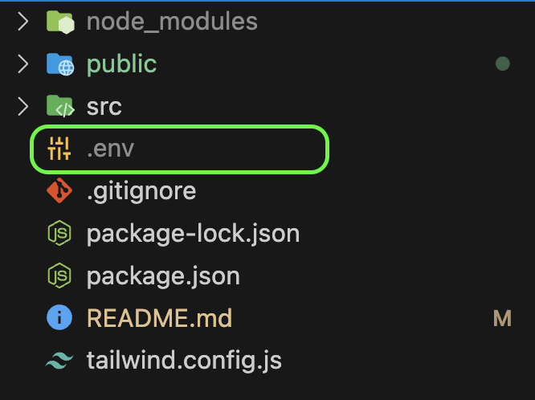
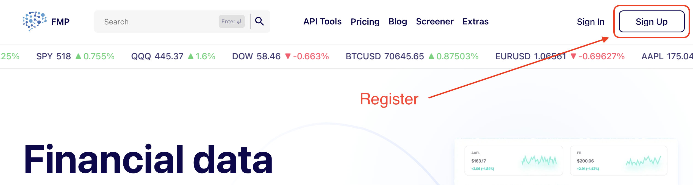
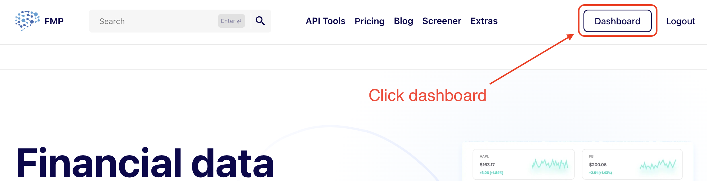
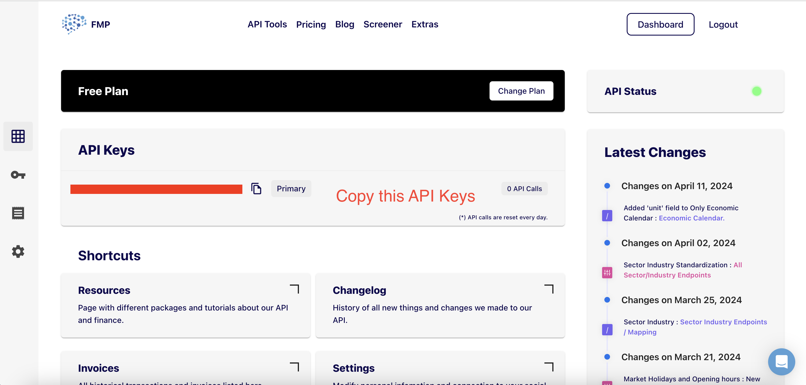
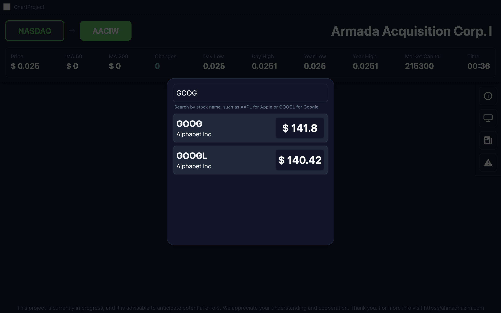
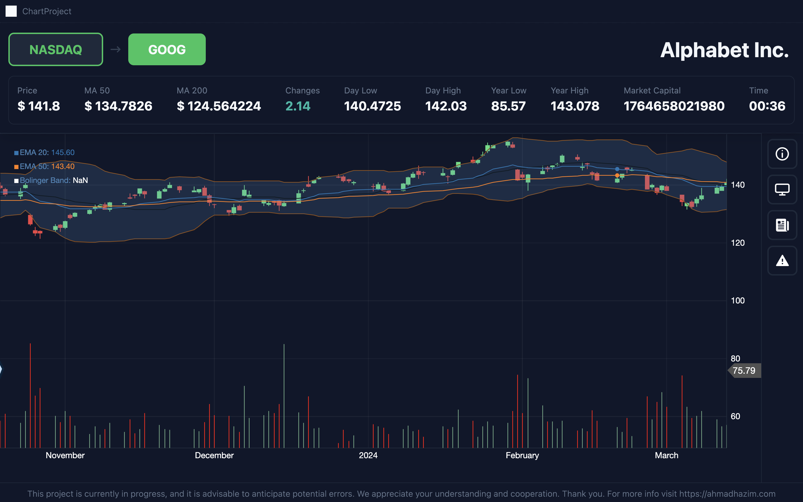
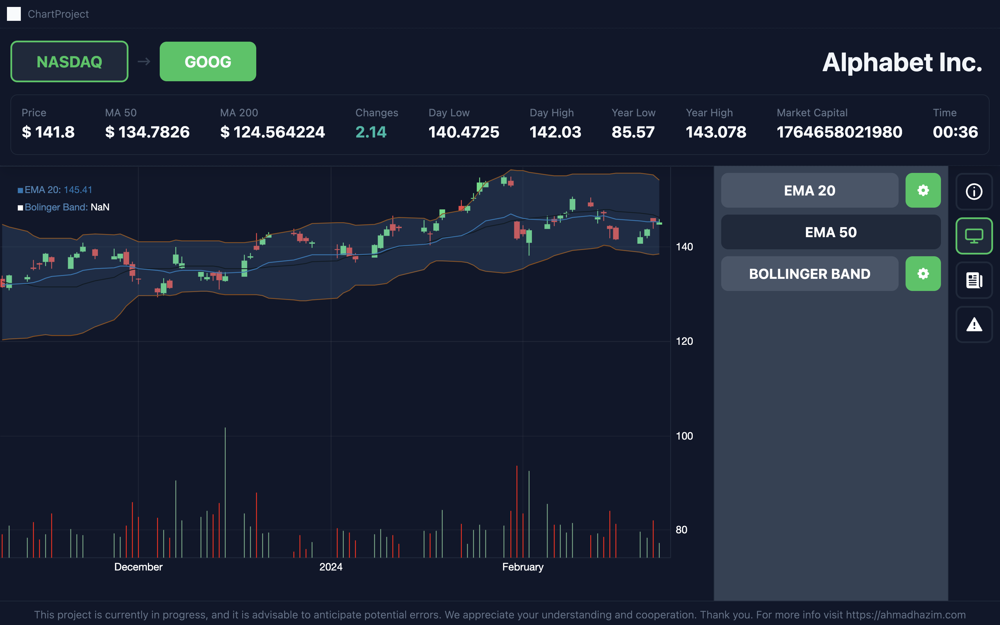

# Understand Stock Charting

## Introduction

This project is designed to facilitate learning the utilization of react-stockcharting, with a dual focus on comprehending the management of substantial datasets from stock timeseries and gaining proficiency in [D3.js](https://d3js.org) simultaneously. Demo [here](https://chart-project-cyan.vercel.app).

## Techical

Step to run this project:

1. Install all packages. ```npm install --legacy-peer-deps```

2. Create new .env file and add ```REACT_APP_API_URL=https://financialmodelingprep.com/api/v3``` and ```REACT_APP_API_KEY``` for this API Key you can register at [FMP](https://site.financialmodelingprep.com/). Here is the detail steps you can follow:
    a. Click register
        
    b. After register they will bring back to homepage and click dashboard
        
    c. You will get your own API Keys, copy them and paste at .env file and name them as REACT_APP_API_KEY
        

## How To Use ?

1. Type a NASDAQ Symbol

2. Wait until chart fully displayed

3. You can on off the indicator here

